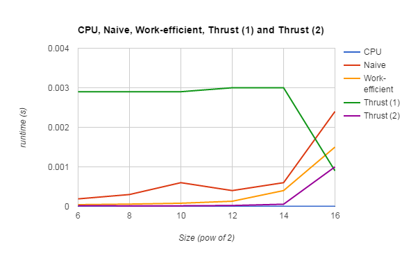
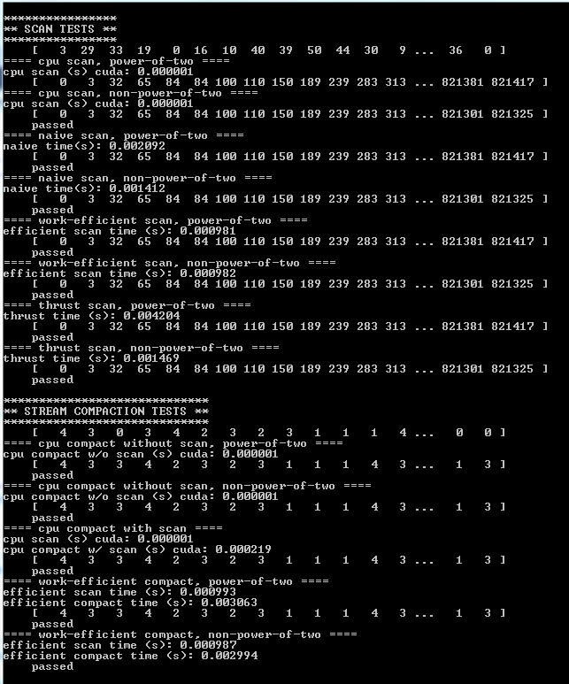

CUDA Stream Compaction
======================

**University of Pennsylvania, CIS 565: GPU Programming and Architecture, Project 2**

* Levi Cai
* Tested on: Windows 7, i7 @ 3.4GHz 16GB, Nvidia NVS 310 (Moore 100C Lab)

### Questions

Above you can see the comparison between the run-times of all the different algorithms. Any initial and final cudamemcpy/malloc's are NOT included, however, any intermediate ones ARE, which is I believe a fairly large contributor to the fact that the algorithms are in general slower than the CPU implementation. I also believe that the array sizes are relatively small, so perhaps the overhead of launching CUDA programs out-weighs the parallelization (though I'm not certain about this to be honest).

In terms of the GPU implementations, the work-efficient algorithm is in general an order of magnitude faster than the naive version. This is most likely because of the necessary overhead of the sequential nature and increased number of operations of the algorithm in addition to the extra cudaMemcpy call in each iteration at each depth in my implementation. 

One thing to note is the Thrust (1) and Thrust (2). I noticed that the first thrust run in a single session took much longer than the second run (1st for a power-of-two and 2nd for a non-power-of-two), I am wondering if it is perhaps caching somewhere.

Sample output:

## Submit

If you have modified any of the `CMakeLists.txt` files at all (aside from the
list of `SOURCE_FILES`), you must test that your project can build in Moore
100B/C. Beware of any build issues discussed on the Google Group.

1. Open a GitHub pull request so that we can see that you have finished.
   The title should be "Submission: YOUR NAME".
2. Send an email to the TA (gmail: kainino1+cis565@) with:
   * **Subject**: in the form of `[CIS565] Project 2: PENNKEY`
   * Direct link to your pull request on GitHub
   * In the form of a grade (0-100+) with comments, evaluate your own
     performance on the project.
   * Feedback on the project itself, if any.
